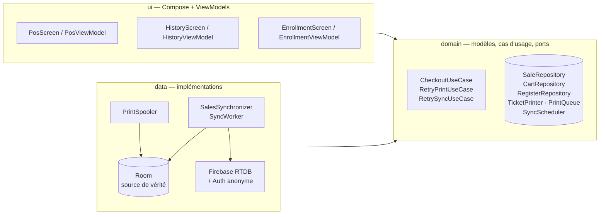
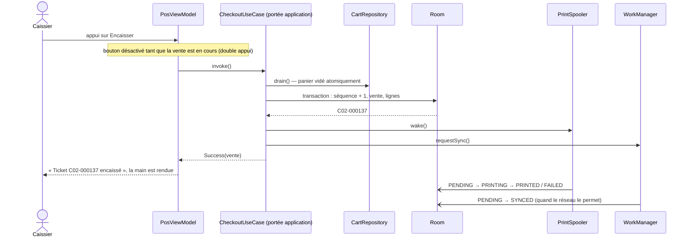

# Architecture

Un seul module `:app`, découpé en couches *Clean Architecture* avec MVVM côté interface.
Les flèches indiquent les dépendances : la couche `domain` ne dépend d'aucune autre.



| Paquet | Rôle |
|---|---|
| `core` | Configuration, injection (Hilt), portée applicative, formatage, état du réseau |
| `domain` | Modèles (`Money`, `Cart`, `Sale`, `TicketNumber`…), interfaces des dépôts, cas d'usage, formatage du ticket |
| `data` | Room (entités, DAO), catalogue codé en dur, panier en mémoire, Firebase, file d'impression, synchronisation |
| `ui` | Écrans Compose (caisse, historique, enregistrement), ViewModels exposant un `StateFlow<UiState>`, navigation |

## Le geste « Encaisser »



Ce qui bloque l'interface se limite à une transaction SQLite de quelques millisecondes. L'impression et
la synchronisation sont asynchrones et reprennent d'elles-mêmes après un redémarrage, car leur état est
en base.

Le cas d'usage s'exécute dans la portée de l'application : quitter l'écran pendant l'encaissement
n'annule pas une vente à moitié faite. Si l'écriture échoue, les lignes retournent dans le panier.

## Modèle de données

### Room

| Table | Colonnes principales |
|---|---|
| `register_state` | une seule ligne : `register_number`, `store_id`, `last_sequence`, `enrolled_at` |
| `sales` | `id` (UUID), `register_number`, `sequence`, `ticket_number` (unique), `total_cents`, `created_at`, `print_status`, `print_attempts`, `last_print_error`, `printed_at`, `sync_status`, `synced_at` |
| `sale_lines` | `sale_id` (FK, cascade), `position`, `product_id`, `product_name`, `unit_price_cents`, `quantity` (copie du produit au moment de la vente) |

Les montants sont des entiers en centimes. Il n'y a aucun `Double` dans les calculs.

### Firebase Realtime Database

```
stores/{storeId}/
  registerCounter              dernier numéro de caisse attribué
  registers/{C02}              { uid, model, enrolledAt }
  sales/{uuid}                 { ticketNumber, registerKey, sequence, totalCents, currency,
                                 createdAt, syncedAt, uid, lines[] }
  ticketIndex/{C02-000137}     uuid de la vente
```

L'état d'impression reste sur la tablette : il ne concerne que l'imprimante branchée à cette caisse.

## Décisions détaillées

- [ADR 0001 — Room comme source de vérité](adr/0001-room-source-de-verite.md)
- [ADR 0002 — Numérotation des tickets par caisse](adr/0002-numerotation-des-tickets.md)
- [ADR 0003 — File d'impression, au moins une fois](adr/0003-impression-au-moins-une-fois.md)
- [ADR 0004 — Synchronisation idempotente](adr/0004-synchronisation-idempotente.md)
